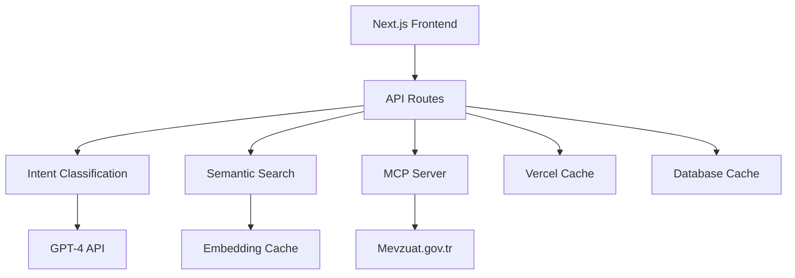

# 🏛️ JurisGen - AI-Powered Turkish Legal Research Assistant

<div align="center">


**Modern, AI-destekli Türk mevzuatı araştırma platformu**

[](https://nextjs.org/)
[](https://www.typescriptlang.org/)
[](https://tailwindcss.com/)
[](LICENSE)

[🚀 Demo](#demo) • [📖 Dokümantasyon](#dokümantasyon) • [⚡ Kurulum](#kurulum) • [🤝 Katkı](#katkı)

</div>

---

## 🎯 **Proje Hakkında**

JurisGen, Türk hukuk sisteminde çalışan avukatlar, hukukçular ve araştırmacılar için geliştirilmiş modern bir AI asistanıdır. Adalet Bakanlığı Mevzuat Bilgi Sistemi ile entegre çalışarak, akıllı arama ve analiz özellikleri sunar.

### ✨ **Temel Özellikler**

- 🧠 **AI-Powered Search**: GPT-4 destekli akıllı mevzuat arama
- 🎯 **Intent Classification**: Kullanıcı niyetini anlayan gelişmiş sınıflandırma
- 🔍 **Semantic Matching**: Anlamsal benzerlik tabanlı sonuç sıralama
- ⚡ **Performance Optimized**: Multi-layer cache sistemi ile hızlı yanıtlar
- 🎨 **Modern UI/UX**: Responsive ve kullanıcı dostu arayüz
- 🔐 **Secure**: Clerk.dev ile güvenli kimlik doğrulama
- 📊 **Analytics**: Kullanım istatistikleri ve performans metrikleri

### 🏗️ **Teknik Mimari**



---

## 🚀 **Kurulum**

### **Ön Gereksinimler**

- Node.js 18+
- Python 3.11+ (MCP sunucusu için)
- Git
- uv package manager (Python)

### **1. Ana Projeyi Kurun**

```bash
# Repository'yi clone'layın
git clone https://github.com/retr0senss/jurisgen.git
cd jurisgen

# Bağımlılıkları yükleyin
npm install

# Environment dosyasını oluşturun
cp .env.example .env.local
```

### **2. Environment Variables Ayarlayın**

`.env.local` dosyasını düzenleyin:

```env
# OpenAI API
OPENAI_API_KEY=your_openai_api_key

# Clerk Authentication
NEXT_PUBLIC_CLERK_PUBLISHABLE_KEY=your_clerk_publishable_key
CLERK_SECRET_KEY=your_clerk_secret_key

# Database (Vercel Postgres)
POSTGRES_URL=your_postgres_url

# Vercel Cache (Optional)
VERCEL_CACHE_TOKEN=your_vercel_token
```

### **3. MCP Sunucusunu Kurun**

```bash
# JurisGen özelleştirmeli MCP sunucusunu clone'layın
git clone https://github.com/retr0senss/mevzuat-mcp-jurisgen.git

# MCP dizinine geçin
cd mevzuat-mcp-jurisgen

# Python bağımlılıklarını yükleyin
uv sync
# veya
pip install -r requirements.txt
```

### **4. Veritabanını Ayarlayın**

```bash
# Prisma migration'ları çalıştırın
npx prisma migrate dev
npx prisma generate
```

### **5. Uygulamayı Çalıştırın**

```bash
# Terminal 1: Ana uygulama
npm run dev

# Terminal 2: MCP HTTP Server
cd mevzuat-mcp-jurisgen
python mevzuat_http_server.py
```

Uygulama [http://localhost:3000](http://localhost:3000) adresinde çalışacak.

---

## 📁 **Proje Yapısı**

```
jurisgen/
├── 📂 src/
│   ├── 📂 app/                    # Next.js App Router
│   │   ├── 📂 api/               # API endpoints
│   │   │   ├── 📂 chat/          # AI chat endpoint
│   │   │   ├── 📂 mevzuat/       # Mevzuat API
│   │   │   └── 📂 user/          # User management
│   │   ├── 📂 chat/              # Chat interface
│   │   ├── 📂 dashboard/         # User dashboard
│   │   └── 📄 layout.tsx         # Root layout
│   ├── 📂 components/            # React bileşenleri
│   │   ├── 📂 ui/               # Shadcn/ui components
│   │   └── 📄 header.tsx        # Navigation
│   ├── 📂 lib/                  # Utility functions
│   │   ├── 📄 grok-intent.ts    # Intent classification
│   │   ├── 📄 semantic-matching.ts # Semantic search
│   │   ├── 📄 result-ranking.ts # Result ranking
│   │   └── 📄 mevzuat-api.ts    # MCP integration
│   └── 📂 stores/               # Zustand stores
├── 📂 prisma/                   # Database schema
├── 📂 public/                   # Static assets
└── 📄 package.json              # Dependencies
```

---

## 🛠️ **Teknoloji Stack**

### **Frontend**

- **Framework**: Next.js 14 (App Router)
- **Language**: TypeScript
- **Styling**: Tailwind CSS + Shadcn/ui
- **State Management**: Zustand
- **Authentication**: Clerk.dev

### **Backend**

- **API**: Next.js API Routes
- **Database**: PostgreSQL + Prisma ORM
- **AI**: OpenAI GPT-4
- **Cache**: Vercel Cache + Custom LRU Cache
- **MCP Server**: FastAPI (Python)

### **AI & Search**

- **Intent Classification**: Custom GPT-4 based system
- **Semantic Search**: Text embeddings + cosine similarity
- **Result Ranking**: Multi-factor scoring algorithm
- **Confidence Scoring**: Bayesian confidence estimation

---

## 🎨 **Özellik Detayları**

### **🧠 AI-Powered Intent Classification**

Sistem, kullanıcı sorgularını analiz ederek 6 farklı kategoriye ayırır:

- `SPECIFIC_SEARCH`: Belirli mevzuat arama
- `GENERAL_LEGAL_QUESTION`: Genel hukuki sorular
- `COMPARATIVE_ANALYSIS`: Karşılaştırmalı analiz
- `PROCEDURAL_QUESTION`: Prosedür soruları
- `CASE_ANALYSIS`: Vaka analizi
- `DEFINITION_REQUEST`: Tanım istekleri

### **🔍 Semantic Matching System**

```typescript
// Örnek semantic matching
const query = "iş sözleşmesi feshi";
const results = await semanticSearch(query, {
  threshold: 0.7,
  maxResults: 10,
  includeSnippets: true,
});
```

### **📊 Multi-Layer Caching**

1. **Browser Cache**: Client-side caching
2. **Vercel Cache**: Edge caching
3. **Database Cache**: Persistent caching
4. **Memory Cache**: LRU in-memory cache

---

## 🚀 **API Endpoints**

### **Chat API**

```http
POST /api/chat
Content-Type: application/json

{
  "message": "İş sözleşmesi feshi hakkında bilgi ver",
  "userId": "user_123"
}
```

### **Mevzuat Search API**

```http
POST /api/mevzuat/search
Content-Type: application/json

{
  "mevzuat_adi": "İş Kanunu",
  "page_number": 1,
  "page_size": 10
}
```

### **Enhanced Search API**

```http
POST /api/enhanced-search
Content-Type: application/json

{
  "query": "işçi hakları",
  "intent": "SPECIFIC_SEARCH",
  "filters": {
    "mevzuat_turleri": ["KANUN"]
  }
}
```

---

## 🔧 **Geliştirme**

### **Development Server**

```bash
npm run dev          # Next.js dev server
npm run build        # Production build
npm run start        # Production server
npm run lint         # ESLint check
npm run type-check   # TypeScript check
```

### **Database Operations**

```bash
npx prisma studio    # Database GUI
npx prisma migrate dev # Run migrations
npx prisma generate  # Generate client
```

### **Testing**

```bash
npm run test         # Run tests
npm run test:watch   # Watch mode
npm run test:coverage # Coverage report
```

---

## 📊 **Performans Metrikleri**

- ⚡ **Response Time**: < 500ms (cached)
- 🎯 **Intent Accuracy**: ~92%
- 📈 **Cache Hit Rate**: ~85%
- 🔍 **Search Relevance**: ~88%

---

## 🤝 **Katkı**

Projeye katkıda bulunmak için:

1. **Fork** yapın
2. **Feature branch** oluşturun (`git checkout -b feature/amazing-feature`)
3. **Commit** yapın (`git commit -m 'feat: Add amazing feature'`)
4. **Push** yapın (`git push origin feature/amazing-feature`)
5. **Pull Request** oluşturun

### **Katkı Kuralları**

- Commit mesajları için [Conventional Commits](https://www.conventionalcommits.org/) kullanın
- TypeScript strict mode'u koruyun
- ESLint kurallarına uyun
- Test coverage %80'in üzerinde tutun

---

## 📜 **Lisans**

Bu proje MIT lisansı altında yayınlanmıştır. Detaylar için [LICENSE](LICENSE) dosyasına bakın.

### **Üçüncü Taraf Bileşenler**

- **mevzuat-mcp-jurisgen**: [retr0senss/mevzuat-mcp-jurisgen](https://github.com/retr0senss/mevzuat-mcp-jurisgen) - MIT License
- **Original MCP**: [saidsurucu/mevzuat-mcp](https://github.com/saidsurucu/mevzuat-mcp) - MIT License

---

## 📞 **İletişim & Destek**

- 🐛 **Bug Reports**: [GitHub Issues](https://github.com/retr0senss/jurisgen/issues)
- 💡 **Feature Requests**: [GitHub Discussions](https://github.com/retr0senss/jurisgen/discussions)
- 📧 **Email**: [İletişim](mailto:your-email@example.com)

---

## 🙏 **Teşekkürler**

- [saidsurucu](https://github.com/saidsurucu) - Orijinal MCP sunucusu için
- [Adalet Bakanlığı](https://mevzuat.gov.tr) - Mevzuat Bilgi Sistemi
- [Vercel](https://vercel.com) - Hosting platform
- [OpenAI](https://openai.com) - GPT-4 API

---

<div align="center">

**⭐ Projeyi beğendiyseniz star vermeyi unutmayın!**

Made with ❤️ in Turkey 🇹🇷

</div>
